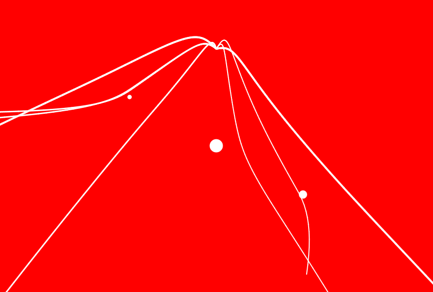

# EINFLUSSPUNKT / Influential dots

## Abstract
Seven particles start at once and fall down due to a gravity force. Additionally, there are three dots of different sizes that exert a repelling force on the particles. After a short time, the particles stop and their path becomes visible.

[See it for yourself!](http://nikoripka.github.io/einflusspunkt/)

## Dependencies
[P5.js](http://p5js.org/) _"The power of Processing times the reach of JavaScript"_

## Usage
There are four Javascript files (plus an html file):
- **sketch.js**: the mother ship
- **particle:system.js**: the particle system
- **particle.js**: each single particle
- **repeller.js**: each single repeller

I encourage you to read Daniel Shiffman's [chapter about particle systems](http://natureofcode.com/book/chapter-4-particle-systems/) and visit [his repositories on GitHub](https://github.com/shiffman/The-Nature-of-Code-Examples/tree/master/chp04_systems/NOC_4_07_ParticleSystemForcesRepeller).

## Thanks
I would like to thank Daniel Siffman from [The Nature of Code](http://natureofcode.com/) and his wonderful [chapter about particle systems](http://natureofcode.com/book/chapter-4-particle-systems/). And I wouldn't have been able to do this without hte help of [Fabian Morón Zirfas](https://github.com/fabiantheblind).

## License
Copyright © 2015 Nikolas Ripka

Permission is hereby granted, free of charge, to any person obtaining a copy
of this software and associated documentation files (the "Software"), to deal
in the Software without restriction, including without limitation the rights
to use, copy, modify, merge, publish, distribute, sublicense, and/or sell
copies of the Software, and to permit persons to whom the Software is
furnished to do so, subject to the following conditions:

The above copyright notice and this permission notice shall be included in all
copies or substantial portions of the Software.

THE SOFTWARE IS PROVIDED "AS IS", WITHOUT WARRANTY OF ANY KIND, EXPRESS OR
IMPLIED, INCLUDING BUT NOT LIMITED TO THE WARRANTIES OF MERCHANTABILITY,
FITNESS FOR A PARTICULAR PURPOSE AND NONINFRINGEMENT. IN NO EVENT SHALL THE
AUTHORS OR COPYRIGHT HOLDERS BE LIABLE FOR ANY CLAIM, DAMAGES OR OTHER
LIABILITY, WHETHER IN AN ACTION OF CONTRACT, TORT OR OTHERWISE, ARISING FROM,
OUT OF OR IN CONNECTION WITH THE SOFTWARE OR THE USE OR OTHER DEALINGS IN THE
SOFTWARE.
